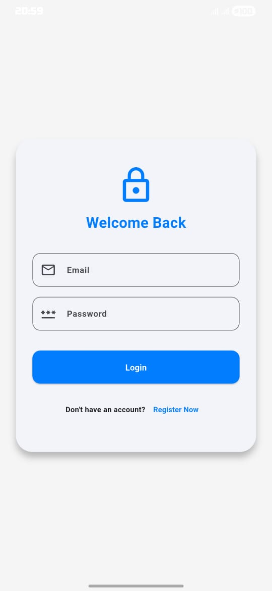
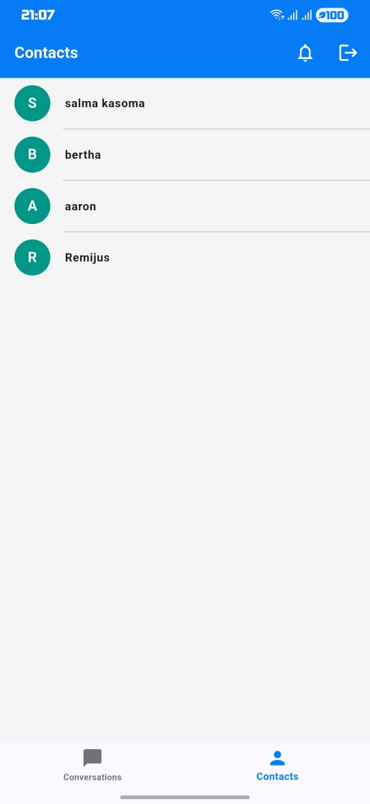
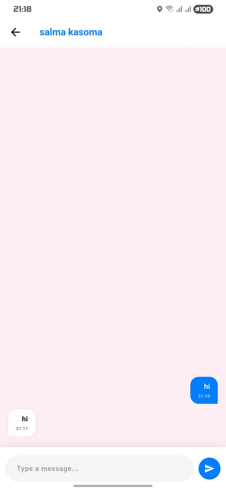
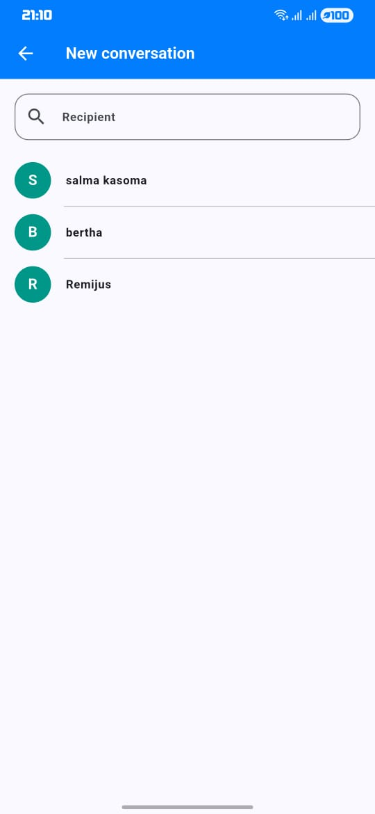
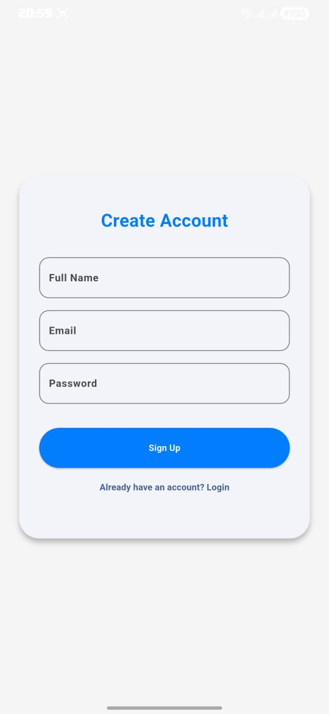

💬 Chat App (Flutter)
A modern, real-time mobile messaging application developed as a collaborative group project. This app leverages the power of Flutter for a beautiful cross-platform UI and Firebase for a robust, scalable backend.

👥 Team Members & Roles
This project was successfully completed by a 10-member team from NIT (BCS/2023).
Name	Registration Number
Remijus Mpiluka	NIT/BCS/2023/604
Salma Kasoma	NIT/BCS/2023/503
Yonah Mathias	NIT/BCS/2023/580
Aron Augustine	NIT/BCS/2023/529
Mark Roden	NIT/BCS/2023/505
Ovino Stanslaus	NIT/BCS/2023/575
Geofrey Michael	NIT/BCS/2023/527
Saleh Alfan	NIT/BCS/2023/488
Ibrahim Hamis	NIT/BCS/2023/512
Thadeo Gabriel	NIT/BCS/2023/611

📝 Project Description
The Chat App is a Flutter-based mobile application that allows users to communicate in real-time. It focuses on security, speed, and a user-friendly experience. Key highlights include:
•	Secure Infrastructure: Utilizes Firebase for managed authentication and database security.
•	Real-time Synchronization: Messages update instantly across all devices without refreshing.
•	Team Collaboration: Demonstrates effective GitHub workflow and modular coding practices within a large group.
✨ Features
•	User Authentication: Secure login and registration using Firebase Authentication.
•	Real-time Chat: Instant messaging via Cloud Firestore.
•	Custom Branding: Adaptive Android launcher icons with a custom Light Blue (#027DFD) theme.
•	Push Notifications: Integrated Firebase Messaging for background alerts.
•	Organized Assets: Centralized management for images, logos, and screenshots.

📱 App Screenshots

  
 Click here to view all screenshots

  
  
  
  
  
  
  
  

⚙️ Technical Integration (pubspec.yaml)
To maintain the app features and visual assets, the following key configurations are defined in the pubspec.yaml:
YAML
dependencies:
  flutter:
    sdk: flutter
  firebase_core: ^2.30.0
  firebase_auth: ^4.17.0
  cloud_firestore: ^4.15.0
  firebase_messaging: ^14.7.0
  intl: ^0.19.0

dev_dependencies:
  flutter_launcher_icons: ^0.13.1

# Custom Launcher Icon Configuration
flutter_launcher_icons:
  android: "launcher_icon"
  ios: false
  image_path: "assets/images/app_icon.png"
  adaptive_icon_background: "#027DFD"
  adaptive_icon_foreground: "assets/images/app_icon.png"

flutter:
  assets:
    - assets/images/
    - assets/screenshots/

🚀 Installation & Setup
1.	Clone the Repo:
Bash
git clone https://github.com/Remijus39/Group1.git 
2.	Navigate & Install:
Bash
cd chat_app
flutter pub get
3.	Firebase Setup:
o	Download google-services.json from your Firebase Console.
o	Place it in android/app/.
o	Verify lib/firebase_options.dart is correctly generated.
4.	Run Application:
Bash
flutter run

